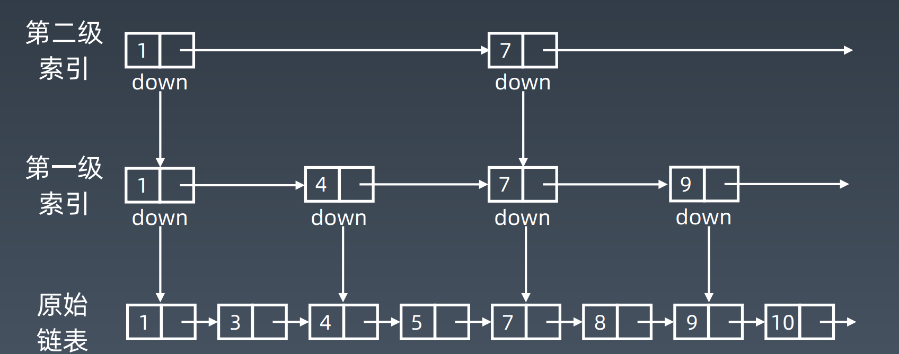

# NOTE

## Week 预习周
数据结构和算法大部分地内容都学过，但是在画脑图的过程中，才更深刻体验到自己的学习是那么地零散，画起脑图来一脸地懵逼，需要各种找资料拼凑总结，后续地学习需要**考虑如何将学习内容系统化**。

目前画地数据结构和算法脑图仅打开，再后续地学习过程中再持续完善。


## Week 01
### 知识点总结
#### 数组
##### 复杂度总结
|            | 随机访问    | 插入                   | 更新        | 删除                   |
| ---------- | ----------- | ---------------------- | ----------- | ---------------------- |
| 操作       | 定位 + 读取 | 定位 + 向后群移 + 写入 | 定位 + 写入 | 定位 + 移除 + 向前群移 |
| 时间复杂度 | O(1)        | O(n)                   | O(1)        | O(n)                   |

#### 链表
##### 复杂度总结
|            | 随机访问    | 插入(头部/中间/尾部) | 更新        | 删除            |
| ---------- | ----------- | -------------------- | ----------- | --------------- |
| 操作       | 定位 + 读取 | 定位 + 调整指针      | 定位 + 写入 | 定位 + 调整指针 |
| 时间复杂度 | O(n)        | **O(n)**                 | **O(n)**        | **O(n)**           |

**疑惑：为什么要忽略链表定位的时间复杂度，从而把链表的插入和删除时间复杂度定为O(1)**

##### 在JAVA 8中的定义

```java
// 双向指针 Node节点不序列化
public class LinkedList<E> extends AbstractSequentialList<E> implements List<E>, Deque<E>, Cloneable, java.io.Serializable {
    
    transient int size = 0;
    transient Node<E> first;
    transient Node<E> last;
    
    private static class Node<E> {
        E item;
        Node<E> next;
        Node<E> prev;

        Node(Node<E> prev, E element, Node<E> next) {
            this.item = element;
            this.next = next;
            this.prev = prev;
        }
	}
}

```

#### 跳表

跳表是对链表随机访问性能进行空间换时间优化的产物。跳表的随机访问性能降为log2(n)- 1，但是维护成本随着索引的层级的增加而大大增加。




#### 栈

Stack：先入后出；添加、删除皆为 O(1) 

##### 在JAVA 8中的定义

```java
public class Stack<E> extends Vector<E> {
    // 注意peek()与pop()的区别，peek()元素不弹出
}
```

在Java中Stack不常用，一般使用Deque代替。

#### 队列

Queue：先入先出；普通队列添加、删除皆为 O(1) 

```java
public interface Queue<E> extends Collection<E> {
    // offer() && pop()在队列空或满时不抛异常
    // add() && remove()在队列空或满时抛异常
}
```

java中的优先队列分析

在Java中的优先队列是通过**二叉堆**实现的，而且是最小堆，底层使用数组进行存储。它的插入和取出操作的复杂度应为**O(logN) ** 【**这跟课件的说法并不一致**】。核心处理方法为siftUp()和siftDown()

```java
public class PriorityQueue<E> extends AbstractQueue<E> implements java.io.Serializable {

	// 二叉堆底层通过数组进行存储
	transient Object[] queue;
	
    public boolean add(E e) {
        return offer(e);
    }
    public boolean offer(E e) {
        //略
            siftUp(i, e);
        return true;
    }
    private void siftUp(int k, E x) {
        if (comparator != null)
            siftUpUsingComparator(k, x);
        else
            siftUpComparable(k, x);
    }

	// 二叉堆新元素小于父级节点则上浮
    @SuppressWarnings("unchecked")
    private void siftUpComparable(int k, E x) {
        Comparable<? super E> key = (Comparable<? super E>) x;
        while (k > 0) {
            int parent = (k - 1) >>> 1;
            Object e = queue[parent];
            // 二叉堆新元素大于等于父级节点则break
            if (key.compareTo((E) e) >= 0)
                break;
            queue[k] = e;
            k = parent;
        }
        queue[k] = key;
    }
    
    // 二叉堆新元素大于右节点则下沉
    private void siftDownComparable(int k, E x) {
        Comparable<? super E> key = (Comparable<? super E>)x;
        int half = size >>> 1;        // loop while a non-leaf
        while (k < half) {
            int child = (k << 1) + 1; // assume left child is least
            Object c = queue[child];
            int right = child + 1;
            if (right < size &&
                ((Comparable<? super E>) c).compareTo((E) queue[right]) > 0)
                c = queue[child = right];
            // 二叉堆新元素小于右节点则break
            if (key.compareTo((E) c) <= 0)
                break;
            queue[k] = c;
            k = child;
        }
        queue[k] = key;
    }
}
```

